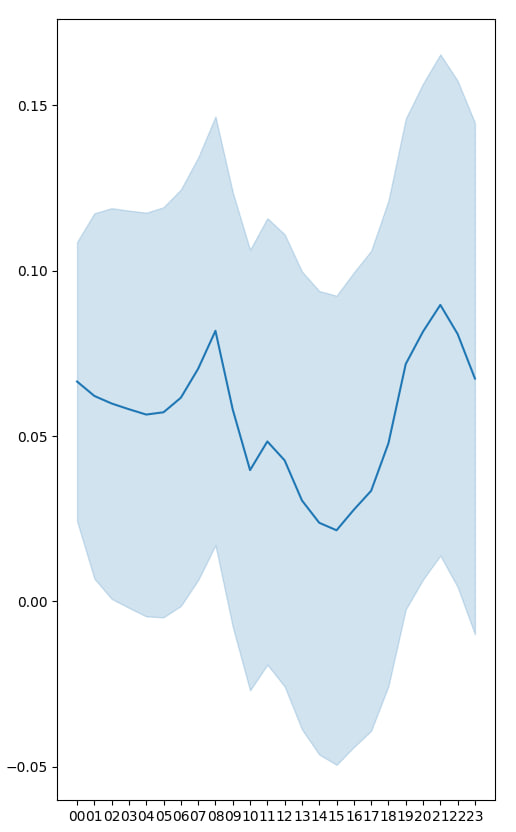
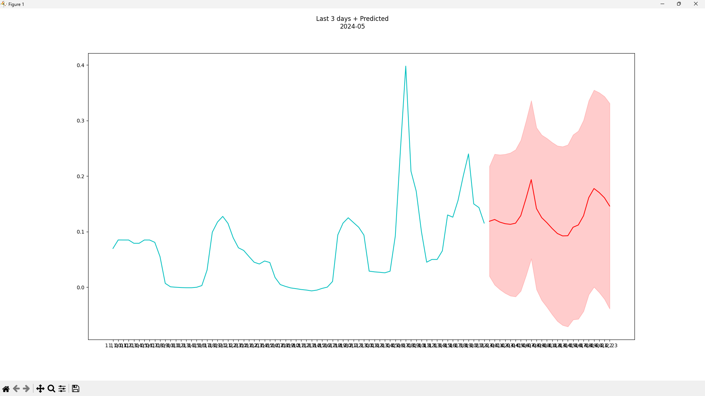

# Forecasting of Electricity Cost

## About project

***

It's practice project while I'm studying Theory of Probabilities.
The sample is price of electricity for each hour for 3 years.
It's so common project, there is no hard algorithms.
**Everything that you can and sometimes need to change is written in the comments of [main.py](main.py) file.**
There are no many strings, so it's easy to check!

I wanted to forecast prices in day. I used SARIMAX model because it's basically model for forecasting and S- in name focused on seasonal data like in my project are 24 hours.

<br>

## Develop story

***



Like a result I've had only 47.23% accuracy test with (0, 1, 3)(1, 0, 1, 24) SARIMAX orders. But I used only 1440 size sample instead of 20k size because I have lack of RAM.
And in orders I curtailed attributes because even with such small sample size I don't have RAM enough.
But If check results fully, then we can notice that if stretch the predicted graph, then an accuracy will be higher.
There are accuracy for each point in graph: `[95.9, 98.43, 91.23, 76.89, 72.4, 79.12, 66.44, 21.07, 4.59, 2.21, 2.35, 4.84, 7.97, 14.15, 22.31, 20.0, 6.15, 0.48, 17.44, 91.09, 85.94, 96.35, 82.32, 74.06]`

<br>

## Result

***



Here you can see the release view. Cyan line is the last 3 days, and red line is predicted, red aria is possible scopes of graph which will be.

You can run it just by 2 steps:

``` PowerShell
cd /path/to/project/
pip install -r requirements.txt
python main.py > output.txt
```

I recommend to use `output.txt` to save SARIMAX protocol


<br>

## Wish

***

I wish someone has a RAM enough and can somehow develop an idea, and I'm interested in what a result will be, or it was such a small experience.


